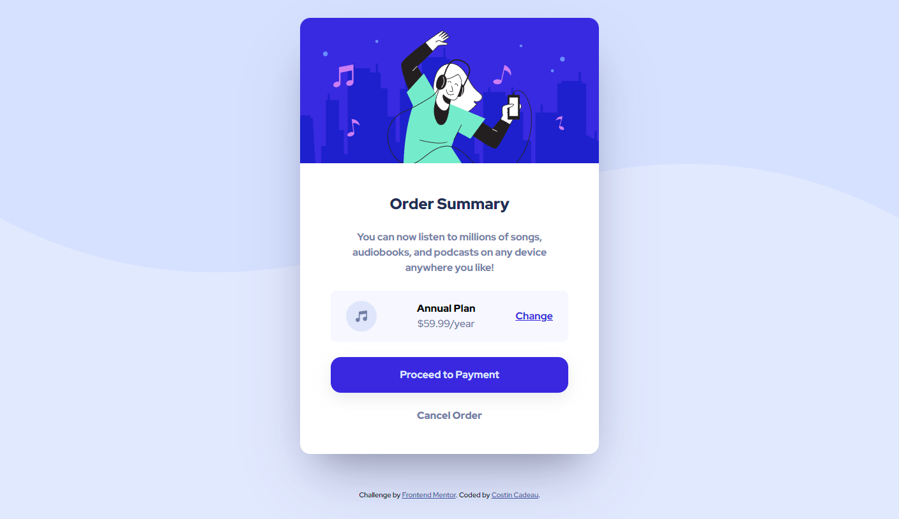

# Frontend Mentor - Order summary card solution

This is a solution to the [Order summary card challenge on Frontend Mentor](https://www.frontendmentor.io/challenges/order-summary-component-QlPmajDUj). Frontend Mentor challenges help you improve your coding skills by building realistic projects. 

## Table of contents

- [Overview](#overview)
  - [The challenge](#the-challenge)
  - [Screenshot](#screenshot)
  - [Links](#links)
- [My process](#my-process)
  - [Built with](#built-with)
  - [Useful resources](#useful-resources)
- [Author](#author)

## Overview

### The challenge

Users should be able to:

- See hover states for interactive elements

### Screenshot

#### *Mobile version :*

#### *Desktop version :*

### Links

- Live : [Add live site URL here](https://your-live-site-url.com)
- Repo Github : [https://github.com/c-costin/order-summary-component](https://github.com/c-costin/order-summary-component)

## My process

### Built with

- Semantic HTML5 markup
- Flexbox
- CSS BEM Methodologie
- Mobile-first workflow

### Useful resources

- [Bunny Fonts](https://fonts.bunny.net/) - I used their CDN for the font.

## Author

- Website - [costincadeau.fr](https://costincadeau.Fr)
- Frontend Mentor - [@c-costin](https://www.frontendmentor.io/profile/c-costin)
